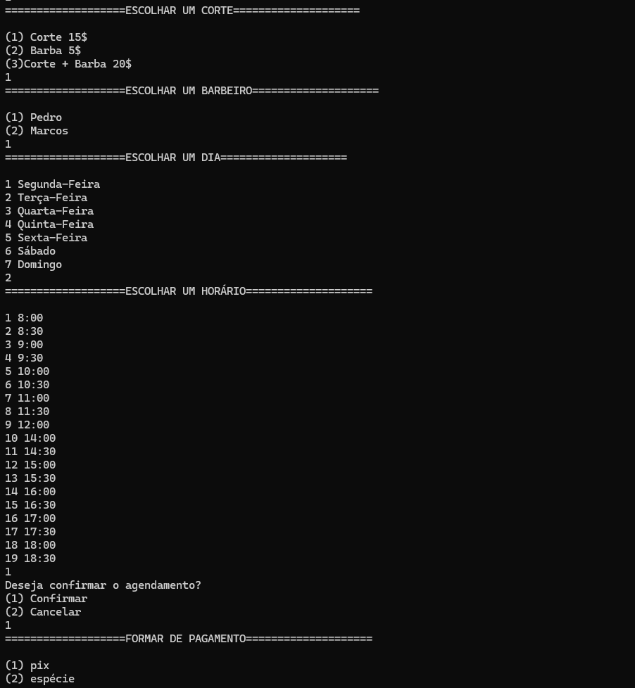

💈 Sistema de Agendamento para Barbearia (C)

Este projeto é um sistema de agendamento voltado para barbearias, desenvolvido em C.
O sistema permite que clientes sejam cadastrados e horários agendados, enquanto o barbeiro (administrador) pode gerenciar todos os agendamentos, visualizar a agenda e controlar os atendimentos.

Ideal para estudar lógica de programação, manipulação de dados e organização de sistemas administrativos.

✅ Funcionalidades

Cadastrar Cliente
Registre o nome, telefone e serviço desejado.

Agendar Horário
Marque um atendimento com data, hora e serviço escolhido.

Listar Agendamentos
Exibe todos os horários e clientes cadastrados de forma organizada.

Área Administrativa do Barbeiro

Visualizar agenda completa

Cancelar ou alterar agendamentos

🛠️ Tecnologias e Conceitos Utilizados

Linguagem C

Estruturas de repetição (for, while)

Condicionais (if, else)

Arrays e manipulação de strings

Funções para modularização

Controle administrativo simulado

Aplicação prática para gestão de serviços

📷 Demonstração

▶️ Como executar

Clone o repositório:

git clone https://github.com/felipesilvalima/Sistema-de-Agendamento-Barbearia.c.git

Acesse a pasta:

cd Sistema-de-Agendamento-para-Barbearia

Compile e execute:

gcc -o  teste1 Sistema-de-Agendamento-Barbearia.c
./teste1

👨‍💻 Autor

Felipe Silva Lima
📧 felipesilvalima200@gmail.com
🔗 LinkedIn
